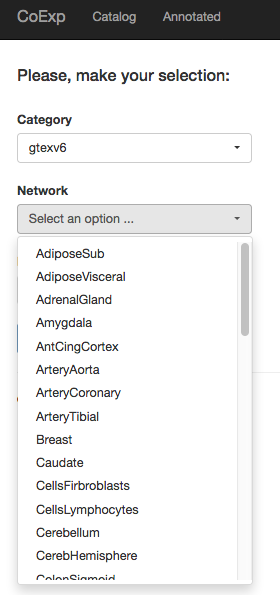
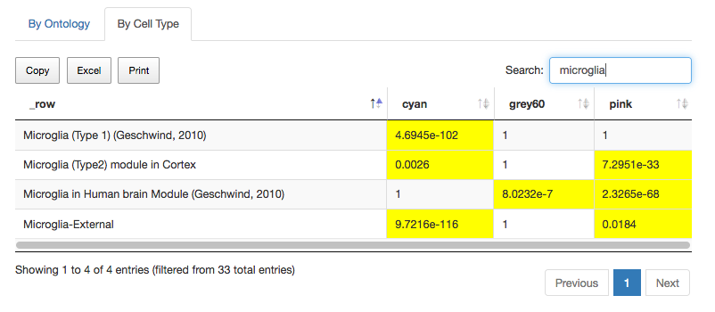
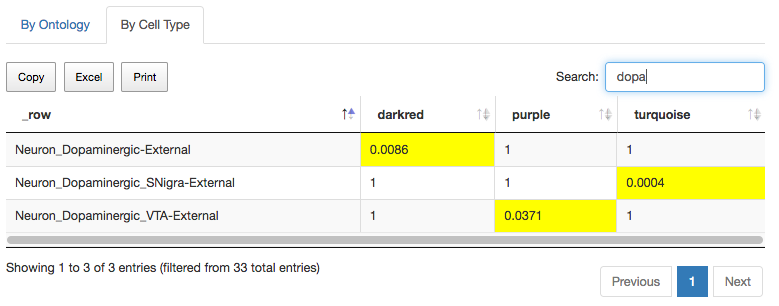
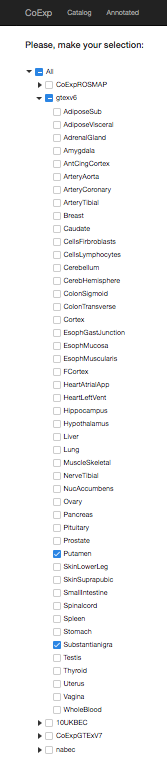
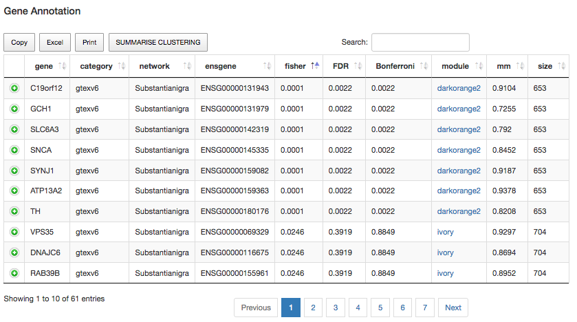
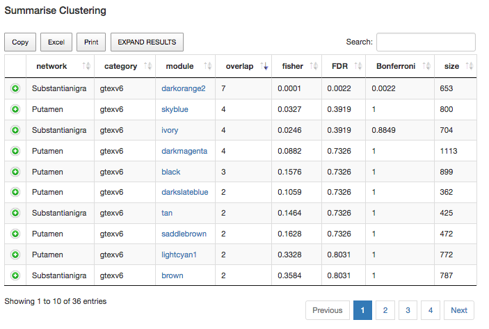

# Introduction

Let us suppose we have a set of genes to annotate and we want to use the CoExp Web tool to do that. We are interested in seeing 

* whether the genes cluster together within a specific co-expression module in a specific tissue more significantly than would be expected by chance

* whether the module in which the genes cluster is enriched for genes with a specific biological function and the reliability of that prediction for each of the genes of interest

* whether the module in which the genes cluster is enriched for any cell-type-specific markers

* whether the clustering of the genes of interest is unique to a module within a specific tissue or whether it is observed within multiple gene co-expression networks.

We will use as an example, the list of monogenic forms of Parkinson from the Genomics England panel App (only the green genes)

> ATP13A2 ATP1A3 C19orf12 CSF1R DCTN1 DNAJC6 FBXO7 FTL GBA GCH1 GRN LRRK2 LYST MAPT OPA3 PANK2 PARK7 PINK1 PLA2G6 PRKN PRKRA RAB39B SLC30A10 SLC39A14 SLC6A3 SNCA SPG11 SPR SYNJ1 TH TUBB4A VPS13A VPS35 WDR45

First thing we have to do is to choose which are the conditions in which we want to study the genes. So in order to see what is available we surf the catalog of CoExp to see what is available there <https://snca.atica.um.es/coexp_test/Run/Catalog/>. 

# Surfing the catalog 

So if we check the categories available

we can see the following:

* 10UKBEC: these are 10 Illumina microarray based gene expression profiling networks from brain tissue, <http://github.com/juanbot/CoExp10UKBEC>
* NABEC: a gene co-expression network created from RNA-seq control Cortex samples quantified at transcript level with Salmon <http://github.com/juanbot/CoExpNABEC>, 

* GTEx V6: 47 co-expression networks on control tissue including 13 brain areas <http://github.com/juanbot/CoExpGTEx>
* GTEx V7: a beta version of the same GTEx 47 co-expression networks  <http://github.com/juanbot/CoExpGTExV7> but now on V7 (i.e. more samples for all them)
* ROSMAP: four networks (all samples, not AD, probable AD and AD) from Frontal Cortex samples, more information here <http://github.com/juanbot/CoExpROSMAP>. 

So if, for example we select GTExV6 we get the figure below.

If we chose Caudate and then selecting the module by ontology and cell typ related terms, we get information on both function annotation (i.e. "By Ontology" tab) and cell type annotation (i.e. "By Cell Type" tab). The GUI caption below is for the "By Ontology" tab. By column

* module: refers to the module, wihtin the network, the annotation term refers to.

* p.value: gProfiler is the tool we use to annotate genes in the modules. This p-value refers to how significant is the overlap of genes associated to the term and the genes in the module. 

* module.size: refers to the number of genes we can find in the corresponding module. 

* ontology: the annotation ontology the term comes from. BP, CC and MF are subontologies from the Gene Ontology and they refer to Biological Process, Cellular Component and Molecular Function respectively. Terms rea and keg refer to the REACTOME and KEGG ontologies. 

Note that for all these search results, using the three bottoms in the upper part `Copy`, `Excel` and `Print` you can get the table to the clipboard, download an excel file with the table or send it to a printer, respectively. 

A co-expression network is a set of modules. These modules (column "module" at the table) are named with colors. They are the clusters genes group into. Currently, we see the Caudate module has 3914 annotations related to function (from the Gene Ontology, REACTOME and KEGG pathways databases mainly). Let´s say we want those terms related with RNA processing. We can use the Search window to select those and we get now only 19 terms out of the 3914 total terms.

We see that the `darkred` module can be a good candidate if we wanted to study RNA processing in the caudate tissue. And there are also other modules hosting more specific terms as well. Note that we can order the terms by using the `ontology` column so we can group terms by which ontology they come from as well. Also, on the left of each row there is a green button with the "+" sign. If we click on it, we will get some expanded information for the row. It depends on the context but for this case, you can see the genes from the module implicated on the overlap between the module and the ontology term. 

Now, let us suppose we are interested only on finding those modules which are specific to the microglia. As we selected to search not only by ontology but also by cell type, we can go to the "By Cell Type" tab, and use again the Search pane and try our luck with "microglia". What we get now is a different table to that we get in the annotation tab. In this case, we test different marker sets (cell type markers more specifically) against all modules. The values in the table to refer the significance of the result. In this case, you see one column for each module, one row for each marker. 

And we can see `cyan`, `pink` and to a lesser extent `grey60` show enrichment for microglial markers. The marker sets can be seen on the rows. Having modules as, for example, cyan with significant signals in more than 1 datasets must be understood in the sense of having alternative evidences of similar phenomena. Apart from the significance reflected by the p-value (i.e. which comes from testing the significance of the overlap between the genes in the module and the genes in the marker set) the more signals related to microglia are significant, the more confident we should be about that. Note that in this case, we distinguish between deactivated (Type 1) and activated microglia (Type 2) in modules cyan and pink respectively. In that way, cyan and pink are reflecting different events of the same phenomena. Actually, if we now look at "By Ontology" by module names and order by ontology to get the REACTOME terms first, we get 

and for the pink term we get

 

It is clear both share generic terms (e.g. Immune System, Innate Immune System) both there are also specific terms for each, i.e. Adaptive immune system for cyan and Cytokine signaling in immune system for pink.

Other interesting searches in regard to cell type may include, as we are dealing with PD, dopaminergic neurons. Therefore, by simply tipping `dopa` we get 

 

Even if the enrichment p-values are not highly remarkable, we can get modest signals that may point us to something. 

# Annotating your genes

After surfing the catalog, let us suppose we want to study these genes in the Putamen and the substantia Nigra. We click in the upper tab `Annotated` to annotate our genes. What we see now is the catalog in tree based menues we can navigate. If we select `gtexv6` and then the corresponding networks

Now we input the genes (you can separate them by spaces or commas) and go!

And we get this table below. Each row corresponds to one of your genes, and one of the networks you selected. In this particular example we  have two rows for each gene (for the nigra and putamen networks, respectively). So we have `gene`, `category` and `network` columns to indicate which gene, the category the network belongs to, and the network respectively. Then we have the `ensgene` for the Ensembl name of the gene. Then we have three columns which refer to the same thing in different manners. And this is how significant is the overlap between your genes and the genes within each module of the network we are using for annotation. The column `fisher` refers to the p-value of a Fisher´s Exact test on this overlap. Column `FDR` refers to the same p-values, adjusted by using False Discovery Rate for multiple testing. The `Bonferroni` column applies a Bonferroni correction factor to the p-values which is based on the number of modules per network with genes from our set. 

One of the first things we may ask this result is how genes cluster together across modules. This is interesting for many reasons but mainly, all genes clustering together in the same module will receive the same annotation, as the annotation comes from the module as a whole. Therefore, the higher the number of genes within your group of genes, belonging to that module, the stronger the link between the phenomena you are studying and the module´s annotation. For example, if we click on the `fisher` column to order p-values from lower to higher, we will see the most evident gene groups within modules, as follows

Here we see that genes C19orf12, GCH1, SLC6A3, SNCA, SYNJ1, ATP13A2 and TH cluster together in the darkorange2 module from substantia nigra. We also see that the clustering is far away from being due to random chance as the fisher´s p-value is 10e-4, but it also survive both FDR and Bonferroni corrections. Another interestint point here is that all genes play a strong role within the module. The `mm` column refers to the module membership of the gene and values from above 0.5 are already strong values. If we click now in any of the `darkorange` labels at the `module` column, we can see that this module is enriched for REACTOME terms as "Axon guidance" and BP terms like "regulation of neurotransmitter levels". The cell type enrichment for the module is totally neuronal, including dopaminergic markers. Thus, this module is clearly Parkinson related. And this analysis suggests all these genes are implicated on those processes, within this cell type, in substantia nigra. Interestingly, you won´t see this replicated in the putamen, that might suggest this happens in nigra but not in the other PD related tissue. 

Are they other significant clusters in this analysis? If we want to see the same table with a summarized view (one row for each module), we can click on "summarize clustering" button, then order by the overlap column (i.e. it refers to the number of genes from our set that falls within the module) to get this table below.

So we see that the only one that is statistically significant is that in the darkorange2 module in nigra. However, seeing 4 genes in putamen clustering inthe skyblue module may be interesting even though the p-value is not significant. Note that we are working on a panel of genes for monogenic PD and most likely the panel is incomplete. 

If we extend the analysis to the whole brain tissues avaiable in GTEx v6, annotate the genes and go to the summarized clustering view, and order by overlap column, from the highest to the lowest values, we get this

And we can see that there is a identical clustering of genes C19orf12, DCTN1, DNAJC6, PANK2, PRKRA, RAB39B, SNCA, SYNJ1, VPS13A, VPS35 in turquoise-Anterior Cingular Cortex but also in brown-Frontal Cortex, and this is somewhat similar to that in substantia nigra. Clearly, in this tissue the cell specificity signal is strongest in dopaminergic neurons.

